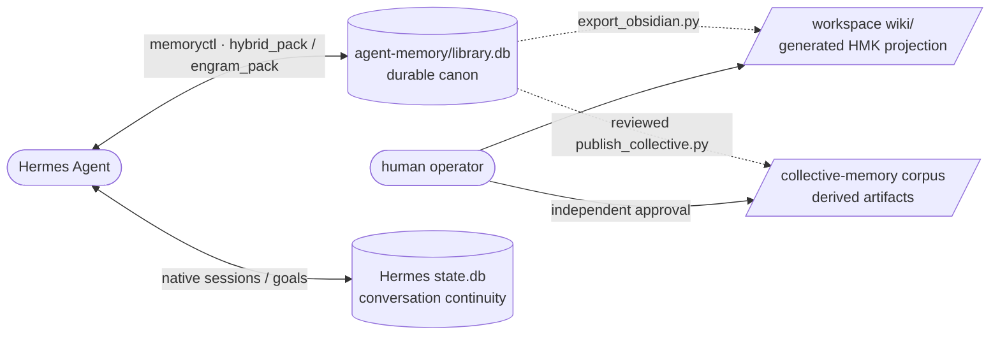

# Hermes Memory Kit

Self-contained memory infrastructure for Hermes-style agents.

[](https://github.com/Mar-IA-no/hermes-memory-kit/releases)
[](LICENSE)
[](https://www.python.org/)
[](https://github.com/NousResearch/hermes-agent)

This repository exists for a very unglamorous reason: real agents forget at the worst possible moment.

Not in the benchmark sense.
In the annoying, daily, operational sense:

- the process restarts;
- the model switches;
- the session gets compacted;
- the operator comes back six hours later and says “seguí”;
- and the agent replies as if the last hour of work had never happened.

`hermes-memory-kit` is the answer to that class of failure.

It gives you a **portable, per-agent workspace** with:

- durable memory in SQLite;
- retrieval that is cheap enough to run on modest hardware;
- continuity files the model can re-absorb after interruption;
- scaffolded scripts and templates;
- and a layout that lets you run more than one agent on the same host without them silently bleeding into each other.

It is not a giant platform. It is not a cloud service. It is not Docker theatre.

It is a practical memory layer for agents that actually live on a machine and need to come back from the dead without becoming stupid.

---

## Table of Contents

- [What This Repo Is](#what-this-repo-is)
- [What You Get](#what-you-get)
- [How the Memory Model Works](#how-the-memory-model-works)
- [Quick Start](#quick-start)
- [What Day-to-Day Usage Feels Like](#what-day-to-day-usage-feels-like)
- [Embeddings and Retrieval](#embeddings-and-retrieval)
- [Workspace Layout](#workspace-layout)
- [Multiple Agents on One Host](#multiple-agents-on-one-host)
- [Continuity Plugin Relationship](#continuity-plugin-relationship)
- [Configuration Notes](#configuration-notes)
- [What This Repo Is Good For](#what-this-repo-is-good-for)
- [What This Repo Is Not Trying to Be](#what-this-repo-is-not-trying-to-be)
- [Repo Map](#repo-map)
- [Docs](#docs)
- [Compatibility](#compatibility)
- [Contributing](#contributing)
- [License](#license)

---

## What This Repo Is

`hermes-memory-kit` is a **workspace scaffold plus memory toolkit** for Hermes-style agents.

The guiding idea is simple:

> **One agent = one directory = one memory world.**

Each agent gets its own:

- `hermes-home/`
- `.env`
- `agent-memory/library.db`
- `agent-memory/state/`
- sessions
- plugins
- skills
- optional generated HMK projection vault

That isolation matters more than it sounds.

If you run multiple agents on the same host, shared default paths are how you get subtle corruption:

- one agent writing into another agent’s DB;
- a plugin reading the wrong handoff;
- a restart recovering the wrong thread;
- or a “helpful” script touching the wrong workspace because an env var was missing.

This kit is opinionated about that. It would rather hard-fail than silently write into the wrong place.

---

## What You Get

The current main branch gives you a working stack with these layers:

### 1. HMK-native durable canon

Stored in `agent-memory/library.db`, managed by `scripts/memoryctl.py`.

This is the long-term memory layer for records authored natively in HMK:

- facts;
- plans;
- evidence;
- curated notes;
- episodic traces;
- and domain-specific shelves such as the Minecraft-scoped `mc-*` shelves when you need them.

### 2. Native re-entry continuity

Hermes native session history and goal state own conversational continuity. HMK
provides durable recall, not a second transcript. New workspaces select HMK with
native MEMORY.md/USER.md stores and `dialogue-handoff` explicitly disabled.

`NOW.md` and optional `ACTIVE-CONTEXT.md` are engineering notes, not current user
intent. The standalone dialogue vendor remains for explicit compatibility use,
but bootstrap/upgrade never install or overwrite it. Existing opt-ins are left
intact. See [native continuity migration](docs/native-continuity.md).

### 3. Generated HMK navigation layer

Projected into `wiki/`.

This is a disposable reading layer over HMK-native records:

- Obsidian navigation;
- LLM-readable maps;
- lightweight projections of the canon.

It is not the separately authored LLM Wiki normally located at `$WIKI_PATH`
or `~/wiki`. That LLM Wiki is authoritative for its own raw evidence and
curated notes; HMK chapters created from those files are retrieval indexes.
The two roots must never overlap. See
[`docs/memory-ownership-contract.md`](docs/memory-ownership-contract.md).

### 4. Operational glue

Scripts and templates that make the system usable instead of merely clever:

- `bootstrap_agent.py`
- `memoryctl.py`
- `continuityctl.py`
- `ingest_any.py`
- `export_obsidian.py`
- `publish_collective.py`
- `scripts/hmk`
- systemd user-service templates

---

## How the Memory Model Works

This repo is easiest to understand if you stop thinking in terms of “database” and start thinking in terms of **memory surfaces**.

### Durable memory

This is the part that should survive everything:

- restarts;
- model changes;
- long projects;
- multi-day work;
- and operator absence.

It lives in SQLite and is retrieved through `memoryctl.py`.

### Working memory

This is the part the model needs *right now* in order to continue naturally.

It is not enough to have a database.
A model returning after a crash does not want “all memory”.
It wants:

- the last arc of the conversation;
- the current working set;
- the immediate thread;
- and a few stable reminders.

Use the selected native Hermes session and goal state for this, not shared
continuity files or a guess about the latest conversation.

### Projection

Humans do not want to read raw SQLite rows.
They want maps, notes, and curated structure.

That is why the generated HMK projection vault exists.

So the mental model is:

- **HMK-native canon** for native records,
- **continuity** for re-entry,
- **HMK projection** for disposable navigation,
- **LLM Wiki** as the authority for documents authored through its publication
  protocol,
- **collective-memory publications** as reviewed downstream artifacts, never
  another authoritative store.



---

## Quick Start

> Requirement: Python 3.10+ and a Linux host if you want systemd integration.

```bash
# 1. Clone the repo
git clone https://github.com/Mar-IA-no/hermes-memory-kit.git
cd hermes-memory-kit

# 2. (Optional) install extras — kit core has zero third-party deps
pip install -r requirements-ingest.txt           # for scripts/ingest_any.py
pip install -r requirements-local-embeddings.txt # for CPU-local embeddings

# 3. Create a self-contained agent workspace
python3 scripts/bootstrap_agent.py ~/agents/hermes-alfa --name hermes-alfa --with-wiki-templates

# 4. Enter the workspace
cd ~/agents/hermes-alfa

# 5. Fill in the basics
vim .env
vim hermes-home/SOUL.md
# Native MEMORY.md/USER.md stores are disabled by default.
# Curate durable knowledge through HMK; keep identity concise in SOUL.md.

# 6. Initialize the memory DB
./scripts/hmk memoryctl.py init

# 7. Install Hermes Agent inside the workspace
git clone https://github.com/NousResearch/hermes-agent.git app
python3 -m venv venv
./venv/bin/pip install -e ./app

# 8. Enable the systemd user service
cp ../../hermes-memory-kit/templates/systemd/hermes-gateway@.service ~/.config/systemd/user/
systemctl --user daemon-reload
systemctl --user enable --now hermes-gateway@hermes-alfa.service
```

At that point you have a real agent directory, not just a pile of scripts.

Everything important lives under that workspace.

---

## What Day-to-Day Usage Feels Like

The intended daily workflow is simple:

```bash
# Initialize / inspect memory
./scripts/hmk memoryctl.py init
./scripts/hmk memoryctl.py stats
./scripts/hmk memoryctl.py embed-config

# Add memory
./scripts/hmk memoryctl.py add-text --shelf library --title "Operator note" --raw "..." --tags operator
./scripts/hmk ingest_any.py --source /path/file.pdf --shelf evidence --title "Paper X" --tags pdf

# Retrieve memory
./scripts/hmk memoryctl.py search --query "what did we conclude about X?"
./scripts/hmk memoryctl.py hybrid-pack --query "what matters right now?" --budget 1800 --limit 4 --threshold 0.4
./scripts/hmk memoryctl.py expand --id 42

# Resume dialogue through Hermes /resume (select the intended session).
# Optional engineering notes are NOT conversation history:
./scripts/hmk continuityctl.py show

# Export selected HMK-native material to the isolated projection vault
./scripts/hmk export_obsidian.py --ids 1 2 3
```

That is the point of the kit: the commands are ordinary, local, inspectable, and boring in a good way.

---

## Embeddings and Retrieval

`memoryctl.py` is no longer just “FTS + maybe embeddings”.

The current line supports a retrieval stack that can be adapted to very different machines:

- `nvidia`
- `google`
- `local`
- `model2vec`

Depending on provider and deploy policy, you can run:

- cloud embeddings,
- local CPU-friendly embeddings,
- or a mixed strategy.

The repo also now includes:

- shelf filters;
- exclude-shelf filters;
- tag filters;
- exclude-tag filters;
- domain-specific shelves such as:
  - `mc-episodic`
  - `mc-social`
  - `mc-skills`
  - `mc-places`

That matters because “memory” is not one homogeneous blob.

Sometimes you want:

- all relevant context;
- sometimes only plans and evidence;
- sometimes everything except Minecraft noise;
- sometimes only Minecraft memory.

That separation is now part of the retrieval surface, not an afterthought.

---

## Workspace Layout

After bootstrap, a workspace looks roughly like this:

```text
~/agents/hermes-alfa/
├── AGENTS.md
├── .env
├── scripts/
├── hermes-home/
│   ├── config.yaml
│   ├── SOUL.md
│   ├── plugins/
│   │   └── hmk-memory/
│   ├── skills/
│   └── sessions/
├── agent-memory/
│   ├── library.db
│   ├── state/
│   │   ├── NOW.md
│   │   └── ACTIVE-CONTEXT.md  (optional, operator-maintained)
│   ├── episodes/
│   ├── plans/
│   ├── evidence/
│   ├── identity/
│   ├── library/
│   └── index/
├── wiki/
├── app/
└── venv/
```

The shape matters.

A workspace should feel like:

- a home,
- a memory archive,
- a runtime envelope,
- and a recoverable operational unit.

Not like a random checkout with a hidden SQLite file somewhere under `/tmp`.

---

## Multiple Agents on One Host

This kit is designed for the case where one host runs several agents with different roles.

Example:

```text
~/agents/
├── hermes-prime/
├── hermes-beta/
└── hermes-minecraft-ermitano/
```

They do **not** share:

- memory DBs;
- continuity files;
- sessions;
- SOUL files;
- wiki projections;
- or plugins installed inside each workspace.

That means you can have:

- a planning agent,
- a research agent,
- a Minecraft-bodied agent,
- and a bot for a messaging platform,

all on the same machine without them stepping on each other’s shoes by default.

---

## Continuity Plugin Relationship

The continuity plugin now lives in its own repo:

- [`hermes-continuity-plugin`](https://github.com/Mar-IA-no/hermes-continuity-plugin)

This kit vendors a pinned copy from that repo.

The pinned version is recorded in:

- `.continuity-plugin-version`

And the vendored copy lives at:

- `templates/plugins/dialogue-handoff/`

That split is deliberate:

- this repo handles **long-term memory and workspace architecture**;
- the plugin handles **working memory and continuity between sessions**.

Most users want both, so the kit bundles the plugin automatically.
But the responsibilities are now cleaner than they used to be.

---

## Configuration Notes

The workspace `.env` is canonical at:

- `hermes-home/.env`

with a symlink from:

- `<agent-root>/.env`

That inversion exists because Hermes Agent upstream rewrites `HERMES_HOME/.env` atomically; putting the real file there avoids symlink breakage on save.

Important practical point:

- the wrapper `./scripts/hmk` is the normal way to run kit commands;
- it loads `.env`,
- exports it,
- and runs commands from the workspace root.

That keeps local CLI behavior aligned with how the workspace is actually configured.

---

## What This Repo Is Good For

This repo is a good fit if you want:

- a memory layer for a real agent running on a real host;
- multi-agent isolation without orchestration bloat;
- SQLite over infrastructure theater;
- recoverable continuity after restarts and model switches;
- retrieval you can inspect, tweak, and reason about;
- a path that works on modest hardware.

---

## What This Repo Is Not Trying to Be

It is **not** trying to be:

- a universal agent platform;
- a giant distributed memory service;
- a social simulation framework;
- a benchmark-driven memory research zoo;
- or a “one magic repo does everything” monolith.

It is intentionally smaller and sharper than that.

The bet here is that disciplined local architecture beats fashionable sprawl surprisingly often.

---

## Repo Map

| Path | Role |
|---|---|
| `scripts/bootstrap_agent.py` | creates or upgrades self-contained agent workspaces |
| `scripts/memoryctl.py` | storage, retrieval, embedding config, search, hybrid-pack |
| `scripts/daimon_projection.py` | closed local API for disposable Daimon Matrix personal-memory retrieval views |
| `scripts/generate_daimon_projection_vectors.py` | regenerates byte-stable projection interoperability vectors |
| `scripts/continuityctl.py` | restart/rehydration helper |
| `scripts/ingest_any.py` | normalizes documents into storable markdown |
| `scripts/export_obsidian.py` | projects selected HMK-native records into an isolated generated vault |
| `scripts/publish_collective.py` | plans and applies independently approved downstream publication artifacts |
| `scripts/hmk` | workspace-aware wrapper |
| `templates/plugins/dialogue-handoff/` | vendored continuity plugin |
| `templates/systemd/hermes-gateway@.service` | per-agent user service template |
| `docs/` | deeper docs and design notes |

There is also a smoke test script in `scripts/`.

Be aware, though:

- the base regression script is useful for scaffold checks;
- but live Hermes + plugin integration should still be verified manually in a real workspace.

The README should not pretend otherwise.

---

## Docs

- [Install](./docs/install.md)
- [Architecture](./docs/architecture.md)
- [Daimon personal-memory projection](./docs/daimon-projection.md)
- [Dialogue Handoff](./docs/dialogue-handoff.md)
- [collective-memory publication](./docs/collective-memory-publication.md)
- [Providers](./docs/providers.md)
- [Curation Pipeline](./docs/curation-pipeline.md)

---

## Compatibility

- Python: 3.10+
- Linux: intended for Linux hosts, especially when using systemd user services
- Hermes Agent: current workflows assume the modern hook/plugin surface used by Hermes `v0.10.x`

If you use older Hermes builds, test the plugin hook contract before trusting continuity behavior.

---

## Contributing

Issues and PRs are welcome.

If you contribute here, the bar is not “looks clever”.
The bar is:

- does it improve recovery after interruption?
- does it reduce ambiguity?
- does it keep workspaces self-contained?
- does it make retrieval more usable instead of noisier?

And if you change behavior around the continuity plugin, test it against a real Hermes workspace instead of trusting only static reasoning.

---

## License

[MIT](LICENSE)
