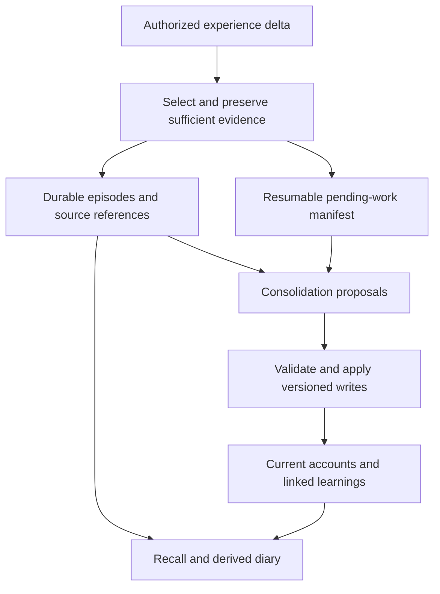

# Improving HMK as a being's lifelong memory

Research cutoff: 2026-10-06. This report consolidates five research lanes using
primary papers, official documentation and selected versioned implementations.
The [raw reports](agent_reports/MANIFEST.md) and [bibliography](BIBLIOGRAPHY.md)
retain dates, inspection scope and uncertainty. No competing system or model
benchmark was run, and no live memory or deployment was changed.

## The decision

HMK has a useful foundation that we should improve before deciding to replace
its canonical storage. The most evident upgrades are reliable capture, preserved
history, attributed episodes, explicit dates, stronger retrieval and measured
consolidation. Those mechanisms can begin on its existing SQLite/chapter/link
core. Component comparisons become worthwhile when a measured limitation remains
after those repairs. A whole-system migration requires proof that meaningful
history, source authority and receiving access survive it.

This recommendation starts with a practical question. Years after a contributor
made an interesting proposal in a project issue, a different body should remember
the known participant, proposal, significance and observed follow-up. It should
also remember a shared moment that produced no useful procedure. We cannot
assume that the original session or external issue will still exist.

The [HMK review](../../docs/general-memory-review.md) already establishes concrete
preservation and retrieval problems. Its fictional diagnostics reproduced a WAL
backup omitting committed data, a skill upgrade deleting acquired work, native
title collisions, overwritten history and several recall failures. Those defects
provide a stronger reason for immediate changes than a vendor's benchmark score.

## Preserve the experience and improve its organization

A durable episode answers what happened, with whom, why it mattered, what the
being did, what followed and what remains unknown. A current account answers
what a person, project or relationship means now. A learning expresses a pattern
drawn from experience. Connecting these products lets synthesis improve without
consuming the life that produced it.

Hindsight's retained material and evidence-linked observations, and Honcho's
observer–subject representations, provide relevant precedents. Their inference
methods still require scrutiny; neither an entity match nor a fluent conclusion
proves identity or witnessed experience.
([Hindsight observations](https://hindsight.vectorize.io/developer/observations),
[Honcho directional representations](https://honcho.dev/docs/v3/documentation/features/advanced/directional-representations))

For the issue example, HMK should keep an episode containing the known account
identifier and proposal, link it to the person and project, and preserve its open
outcome. A later clarification adds to that history. Updating the project's
present capsule must leave the earlier contribution discoverable. Unknown real
names and dates remain unknown. Meaningful ordinary experiences deserve the same
care even when no skill or stable preference follows.

Attribution must survive compression and retrieval. An observed encounter, a
human's report, a tool's returned communication, an inferred relationship and a
generated illustration carry different kinds of evidence. Occurrence time,
report time and recording time serve different purposes. Temporal graph research
offers useful date distinctions, while multimodal episodic work distinguishes
speaker claims from sensor interpretations.
([Zep paper](https://arxiv.org/html/2501.13956v1),
[multimodal episodic-memory study](https://aclanthology.org/2025.dnd-16.10/))

## Sleep is a useful process that needs a preservation contract

Anthropic currently documents Dreams as a research preview: synthesis creates
separate output while retaining input. Letta's sleep-time work and LangMem's
formation primitives also separate interaction from later memory processing.
These are concrete references for a consolidation process, with distinct designs
and operating assumptions.
([Anthropic Dreams](https://platform.claude.com/docs/en/managed-agents/dreams),
[sleep-time paper](https://arxiv.org/html/2504.13171v1),
[LangMem background formation](https://langchain-ai.github.io/langmem/background_quickstart/))

For HMK, prompt capture should protect irreplaceable selected evidence; a later
dream can reorganize accounts, connect episodes and propose lessons. The original
full transcript need not become permanent memory. The selected account must
retain enough meaning to survive transcript loss, and pending work needs enough
authorized evidence for retry.

Consolidation is not an automatic quality gain. LightMem's published experiments
include configurations where offline updating lowers QA accuracy. We therefore
need before/after recall tests and reversible changes.
([LightMem paper](https://arxiv.org/html/2510.18866v4))

HMK also has an existing proposed distiller to build on. Its open PR excludes
tool messages, uses a transcript tail and performs best-effort work without a
durable checkpoint. That makes it an antecedent to improve rather than a complete
solution to this requirement.
([HMK PR #1](https://github.com/Mar-IA-no/hermes-memory-kit/pull/1))

## The proposed loop

This is a proposed architecture; it has not been installed.

Each body/source stream supplies stable event identities and source versions.
Late corrections become new input. Policy and model versions describe processing;
rerunning a policy does not invent another encounter. Applied and deliberately
omitted outcomes are recorded before advancing the processed cursor. Failed or
deferred material remains visible. Persistence, lexical indexing, embeddings and
diary rendering have separate completion states.

The process considers meaningful tool communications and observed actions as
well as human dialogue and embodied encounters. It omits mechanical noise under
the selection policy. There is no fixed minimum conversation length or fact quota
that can silently discard a meaningful first encounter.

Manual foreground invocation is the initial integration for this Codex body.
Future daily, idle, step-count or compression triggers can use the same API when
the owning deployment authorizes them. Session end is an additional opportunity;
sessions may stay open and processes may crash. The trigger must account for
source availability rather than merely follow a calendar.

## Recall, learning and a diary

HMK should preserve Unicode names and identifiers anywhere in a question, retain
distinct same-project episodes, navigate incoming and outgoing links, and expose
source attribution in compact results. Relevance gates should precede quotas and
fusion. Embedding outages should produce explicit degraded lexical results.
Historical questions should recover past evidence; present questions should use
the latest qualified account. A weak cue about a ten-year-old episode must not
lose solely because recent unrelated memories dominate.

A diary can make this history navigable through time, people, projects and bodies.
It should render canonical episodes and selected assets, retain enough text when
an image disappears, and distinguish an illustration from evidence of a scene.
Its rendering is independently rebuildable. It does not become the only memory
or a new source that confirms its own generated narration.

Procedural learning similarly retains supporting episodes while the maintained
skill package holds tested execution details. The being can remember its own
project and know another body has suitable tools; the current body must check its
actual capabilities before acting. Detailed repository state remains in the
project's declared surfaces.

## How to decide whether to replace anything

The first comparisons should target bounded components. LangMem offers formation
primitives; Graphiti offers temporal/entity indexing; Hindsight merits a recall
and consolidation comparison, including its inspected recovery contract. These
are experimental candidates, not an ordered ranking. Deploying a service adds
stores, model calls, migrations and recovery work that the comparison must count.
The [deployment report](agent_reports/05_evolution_options.md) records current
licenses, dependencies, source versions and export limits.

Current code matters as much as older papers. Mem0's automatic extraction is now
ADD-only while explicit correction and history APIs remain. Letta's active source
has moved to Letta Code, whose persistence interfaces differ from its retired
server. We must pin versions and compare actual behavior before adopting code.
([Mem0 migration guide](https://github.com/mem0ai/mem0/blob/c93420c49a6b14c3d446bdb156d96811908fd90a/docs/migration/oss-v2-to-v3.mdx),
[current Letta source](https://github.com/letta-ai/letta-code/tree/4b028fab07c69edaac2ddb4f7b9a43573ff20d81))

Replacement becomes justified when a candidate solves a measured HMK limitation
within the agreed quality and operating budget. Replacing an index can leave
SQLite canonical. Replacing canon additionally requires a complete manifest of
available memories/history/sources/assets, deterministic transport, verified
restore, incremental correction replay, receiving acceptance and rollback that
accounts for new writes. Signed Matrix material and independently authored Wiki
files keep their authority throughout.

## Prove continuity at each layer

External evaluations give useful dimensions: LongMemEval separates recall and
answering; LoCoMo-Plus tests implicit cues; Memora penalizes stale memory use;
newer trajectory benchmarks probe learned workflows and environment gotchas.
Their scores do not establish our lifecycle requirement.
([LongMemEval](https://github.com/xiaowu0162/LongMemEval),
[LoCoMo-Plus](https://aclanthology.org/2026.acl-long.1150/),
[Memora](https://arxiv.org/abs/2604.20006))

The [maintained plan](../../docs/durable-recall-plan.md) uses the existing fictional
corpus to test selection, persistence, repeated consolidation, retrieval and
supported answers separately. It adds source loss, an injected ten-year retrieval
clock, newer distractors, crashes/replay, late corrections and body changes.
Formation and recall costs are measured separately. Wrong participants, erased
history or invented outcomes fail the critical scenario regardless of average QA.

This research closes the evidence-gathering delivery and strengthens that plan.
Runtime fixes, model pilots, scale measurements and live adoption remain work to
execute. Each coherent change and its observed validation should be published as
it lands, so others can choose to incorporate it.
